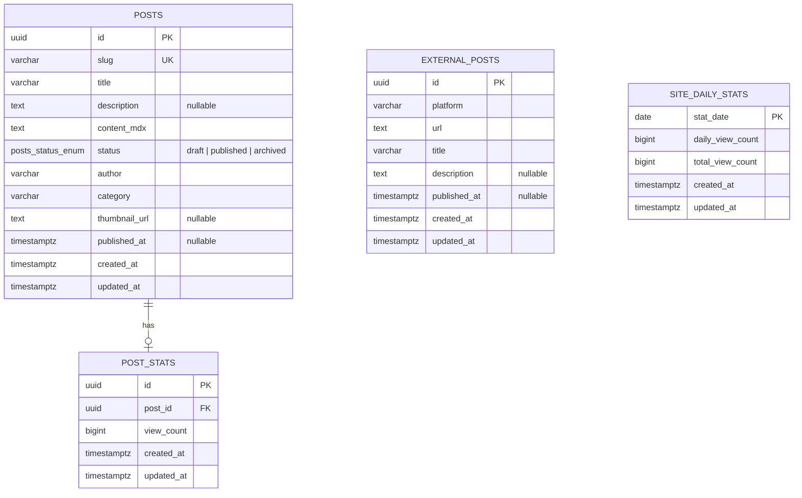

# CMS DB ERD

이번 CMS DB의 방향과 테이블 책임을 Mermaid ERD로 정리한다.

이번 PR에서 실제 생성하는 테이블은 `posts` 하나다. `external_posts`, `post_stats`, `site_daily_stats`는 후속 PR에서 별도로 구현한다.



## 테이블 설명

| 테이블 | 설명 |
|---|---|
| `posts` | 내부 CMS에서 직접 작성하고 관리하는 글이다. MDX 본문, 공개 상태, 발행 시각을 가진다. |
| `external_posts` | Velog, Medium, LinkedIn 등 외부 플랫폼에 내가 직접 발행한 글을 내 블로그에서도 보여주기 위한 테이블이다. `posts`와 FK 관계를 두지 않고 독립 콘텐츠로 다룬다. |
| `post_stats` | 글별 노출용 조회수를 저장한다. 글 상세/목록에서 보여줄 집계 값을 담당한다. |
| `site_daily_stats` | 사이트 전체 조회수를 KST 날짜 단위로 저장한다. `stat_date`는 한국 날짜 기준이다. |

## posts 상태 정책

| 상태 | 의미 | 공개 정책 |
|---|---|---|
| `draft` | 작성 중 | 공개되지 않음 |
| `published` | 공개됨 | 목록/상세 조회 대상 |
| `archived` | 보관됨 | 목록/상세에서 기본 제외 |

초기 상태 전이는 아래 흐름을 기준으로 한다.

```text
draft -> published -> archived
```

## posts 인덱스/제약조건

| 이름 | 대상 | 목적 |
|---|---|---|
| `PK_posts_id` | `id` | Primary Key |
| `UQ_posts_slug` | `slug` | URL 식별자 중복 방지 |
| `IDX_posts_status_published_at` | `status`, `published_at` | 공개 글 목록 조회 |
| `CHK_posts_published_requires_published_at` | `status`, `published_at` | `published` 상태 글의 발행 시각 필수 보장 |