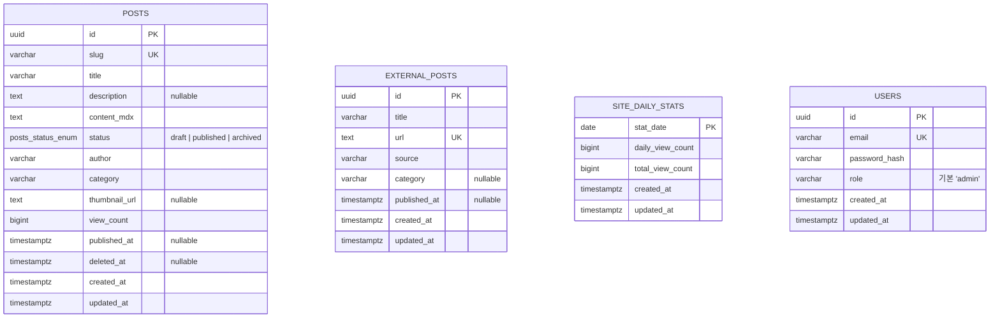

# CMS DB ERD

CMS DB의 방향과 테이블 책임을 Mermaid ERD로 정리한다.

이번 PR에서 실제 생성하는 테이블은 `posts`와 `external_posts` 두 개다. `site_daily_stats`는 후속 PR에서 별도로 구현한다.

`external_posts`는 `posts`와 **FK 관계를 두지 않는다.** 두 테이블은 라이프사이클이 분리되어 있어 한 쪽이 다른 쪽의 존재에 의존하지 않으며, 블로그 목록에서 합쳐서 보여주기 위해 도메인 레벨에서만 연결한다.

## 테이블 설명

| 테이블 | 설명 |
|---|---|
| `posts` | 내부 CMS에서 직접 작성하고 관리하는 글이다. MDX 본문, 공개 상태, 발행 시각, 글별 누적 조회수를 가진다. |
| `external_posts` | Medium, GitHub, Velog 등 외부 플랫폼에 내가 직접 발행한 글을 내 블로그 목록에서 함께 보여주기 위한 테이블이다. `posts`와 FK 관계를 두지 않고 독립 콘텐츠로 다루며, 기존 블로그 목록과 동일하게 `category`를 보관한다. `posts`와 라이프사이클이 분리되어 있으며, 블로그 목록에서는 후속 PR에서 `posts + external_posts`를 `published_at` 기준으로 합쳐 제공할 예정이다. |
| `site_daily_stats` | 사이트 전체 조회수를 KST 날짜 단위로 저장한다. `stat_date`는 한국 날짜 기준이다. |
| `users` | admin/CMS 로그인 계정. 운영 정책상 본인 1인만 admin. 계정은 운영자가 hash-password 스크립으로 argon2 hash 를 만들어 직접 INSERT 한다 (자세히: `docs/auth-strategy.md`). |
